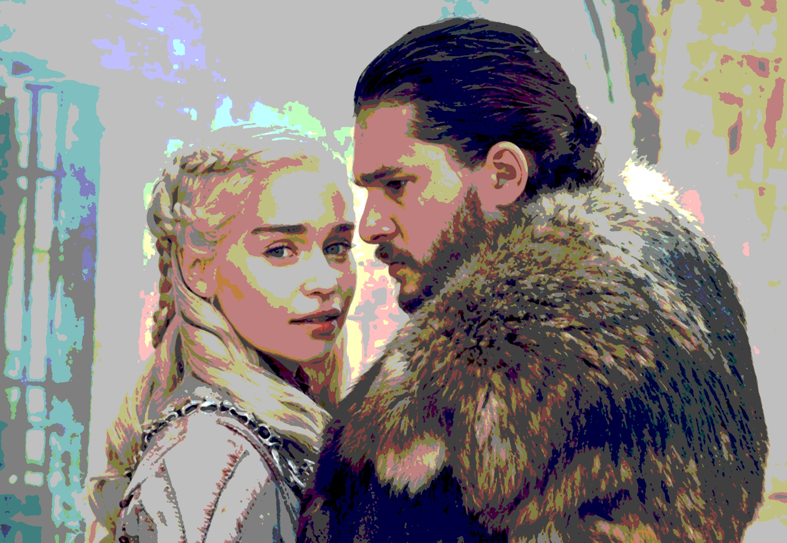

Posterization using OpenCV

Project Description
This project applies posterization and cartoonization techniques to images using OpenCV.
Posterization reduces the number of colors using a Look-Up Table (LUT), while cartoonization enhances edges and simplifies textures.

Approach used here are as follows

1. Read and preprocess image

Load the image from assets/input.jpg

Apply median blur to smooth noise

2. Posterization using LUT

Generate n evenly spaced intensity levels

Build a 256-value LUT mapping 0–255 → nearest level

Apply LUT to all 3 channels

3. Save results

Outputs are saved in the results/ folder.

How to Run This Project

1. Install dependencies
pip install -r requirements.txt

2. Add your input image

Place your image inside:

assets/input.jpg

3. Run the main script
python src/main.py

4. Output

Your processed image will be saved here:

results/output.jpg

Sample Output

Original Image

Posterized Output

